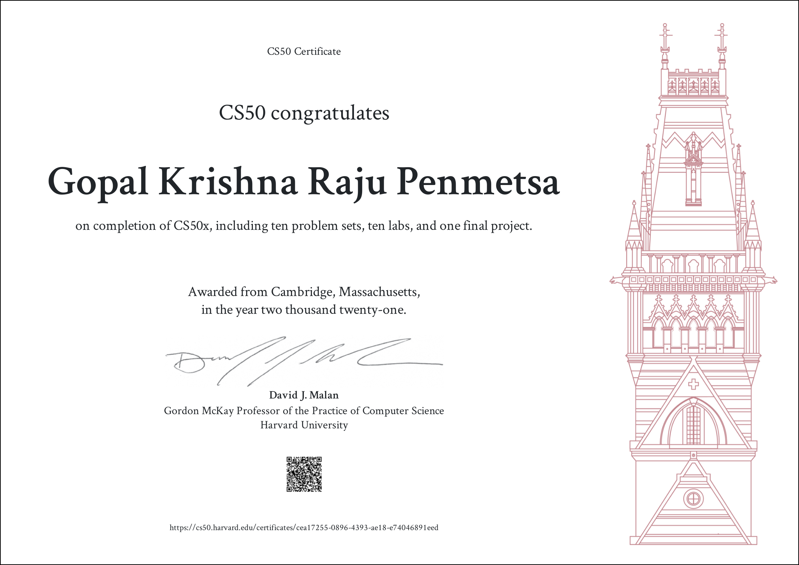

# CS50x

This repository contains a coursework done for Harvard's [CS50x](https://cs50.harvard.edu/x/2021/) via this OpenCourseWare.

> Note: all the coursework was done on CS50 IDE and then uploaded to github.

This course serves as an introduction to computer science and teaches how to think algorithmically and solve problems efficiently. 

Topics include are:
- abstraction
- algorithms
- data structures
- encapsulation
- resource management
- security
- software engineering
- web programming

Languages include C, Python, and SQL plus HTML, CSS, and JavaScript.

## Resources

Edx : [CS50's Introduction to Computer Science](https://www.edx.org/course/introduction-computer-science-harvardx-cs50x)

Opencourseware : [CS50x 2021](https://cs50.harvard.edu/x/2021)

video lectures : [youtube](https://www.youtube.com/user/cs50tv)

## Getting started

All CS50x problem sets and assignments can be done via [ide.cs50.io](https://ide.cs50.io/).

## Final Certificate

> **Note**: To comply with [Academic Honesty](https://cs50.harvard.edu/x/2020/honesty/) DO NOT use the code for coursework.
